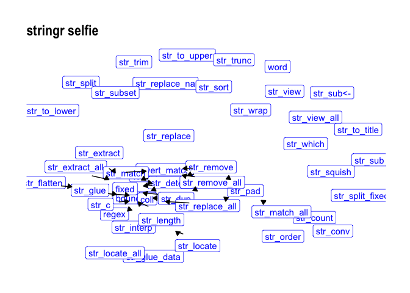
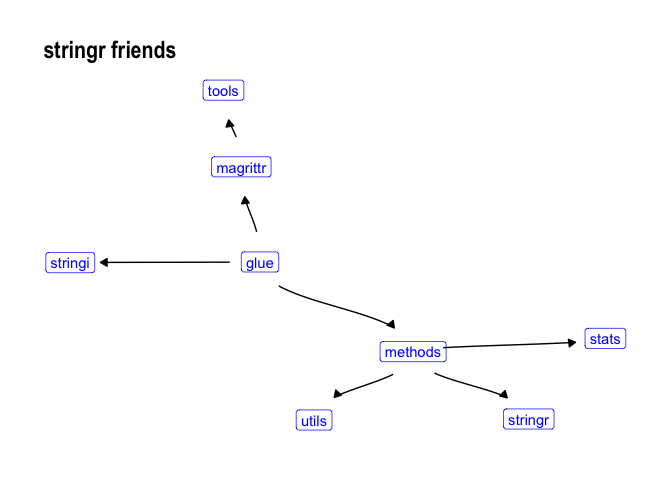
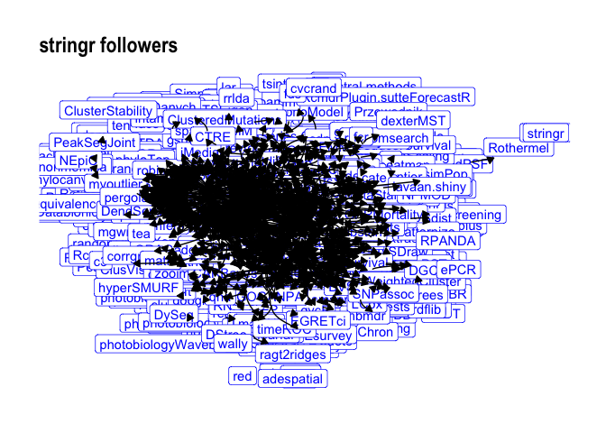

-   [Package Is Cool](#package-is-cool)
    -   [Install pic](#install-pic)
    -   [Take a pic](#take-a-pic)
    -   [Selfie](#selfie)
    -   [Friend pic](#friend-pic)
    -   [Follower pic](#follower-pic)
    -   [TL;DR](#tldr)

------------------------------------------------------------------------

Package Is Cool
---------------

Oh hey, what a cool package!

### Install pic

``` r
install.packages("devtools")
devtools::install_github("anthonypileggi/pic")
```

### Take a pic

R packages are cool. And cool packages are the best. That's so cool!

``` r
library(pic)
x <- pic("stringr")
#> Warning: package 'stringr' was built under R version 3.4.4
#> Warning: package 'bindrcpp' was built under R version 3.4.4
summary(x)
#> Wow, `stringr` is such a cool package!
#> It has at least 46 functions.  Cool!
#> Oh, and did you know there are at least 52 intra-function dependencies? That's crazy!
#> Friends are cool and dependable!  This package has 8 of them!
#> And there are 3123 followers depending on `stringr`.  What a cool package!
#> Want to see something cool?
#>  Selfie:                          plot(x, type = 'selfie')
#>  Friends (i.e., dependencies):    plot(x, type = 'friends')
#>  Followers (i.e., dependents):    plot(x, type = 'followers')
```

### Selfie

``` r
plot(x, type = "selfie")
```



Well whatdya know, that *is* pretty cool!

### Friend pic

Friends are cool too. Hey, I bet cool packages have lots of friends!

``` r
plot(x, type = "friends")
```



### Follower pic

Everyone knows that cool packages with lots of friends have lots of followers. Cool!

``` r
plot(x, type = "followers")
```



### TL;DR

Well, I think we can all agree. This **p**ackage **i**s **c**ool.
